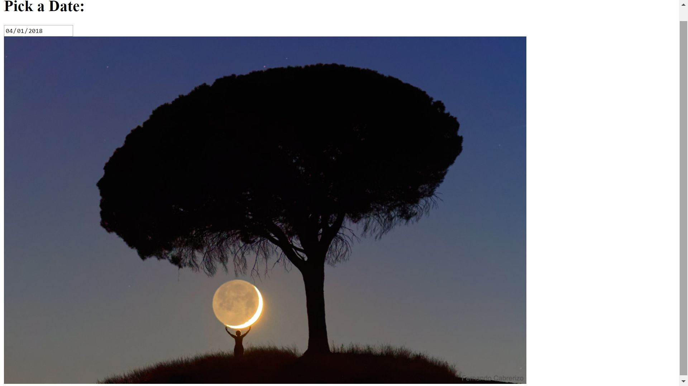

Nasa Pic of the day API

This app allows the user to pick a date and the Nasa picture or video of the day will be revealed.

Link to project:https://rakimdevcraig.github.io/nasaPicOfDay/

How It's Made:
Tech used: HTML, CSS, JavaScript, jQuery, API

We make an ajax request to Nasa's api and if successful we go into the function. The function states that if the parameter we get back from NASA which is the URL to the picture of the day is jpg, jpeg, or png which are popular image formats then we would add it to the blank image we have in our html, if it wasn't an image and was a video which Nasa would sometimes post instead of a picture we would take the source and add it to our iframe and the video would be ready to be played.

Lessons Learned:
At first we were able to display the image for days that the picture of the day was an image but the days that it was a video nothing would display. This led to us setting our conditional up to target the source so if it's an image we would print it to the image we had in out html and if it was anything else we would print it to the
iframe.

Examples:
Take a look at these couple examples that I have in my own portfolio:
